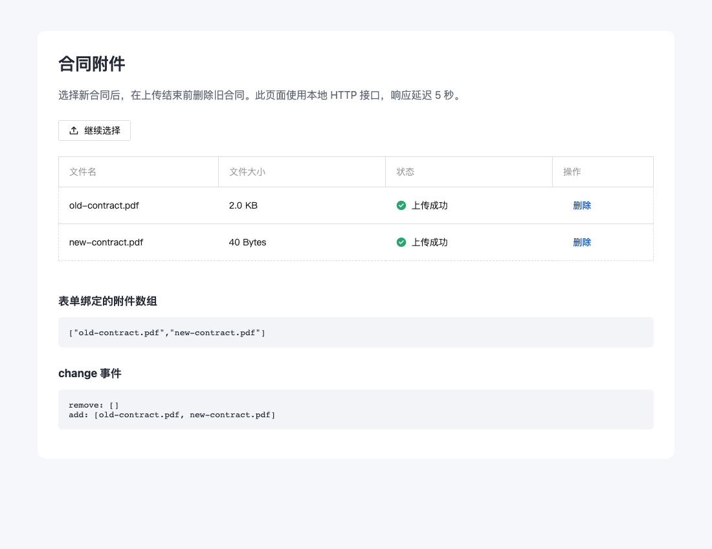
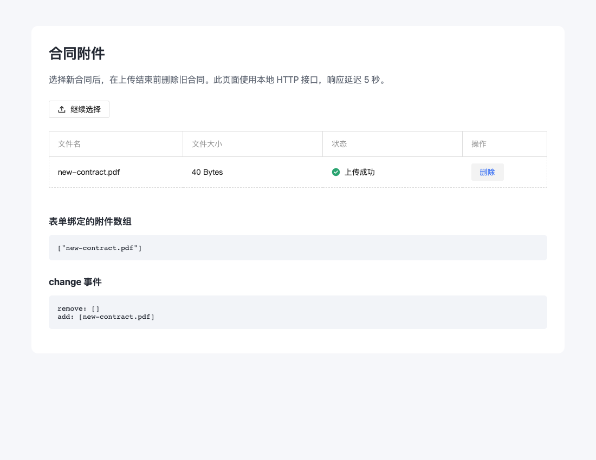

# Upload 上传期间删除附件复现

版本：tdesign-vue-next 1.20.7、Vue 3.5.34。

下载同目录的 `index.html` 后，用浏览器打开即可。页面通过 CDN 加载两个固定版本的依赖，需要联网；不需要安装依赖或配置上传服务。给页面地址添加 `?combined` 可以验证 `uploadAllFilesInOneRequest=true`。

1. 页面初始有 `old-contract.pdf`。
2. 点击“继续选择”，选择另一个本地文件。
3. 点击旧合同所在行的“删除”。此时旧合同消失，下面的绑定数组为 `[]`。
4. 点击“返回上传成功”。

预期只保留新文件。1.20.7 的实际结果是旧合同被重新添加，`change` 先输出 `remove: []`，随后输出 `add: [old-contract.pdf, 新文件名]`。

最小示例通过公开的 `request-method` 属性控制返回时机，没有访问组件内部状态，所选文件不会发出网络上传请求。另外已在本地 HTTP 上传接口（延迟 5 秒返回成功）上验证相同步骤，普通请求与合并请求均可复现。

本目录包含 HTTP 复现页面的修复前后截图：

| 原始 1.20.7：旧附件重新出现 | 修复后：只保留新附件 |
| --- | --- |
|  |  |
